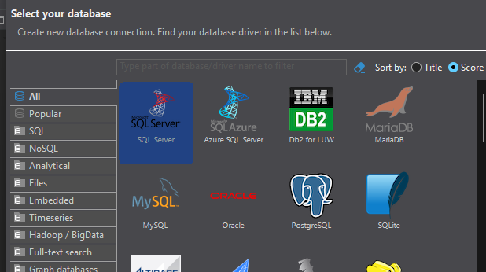
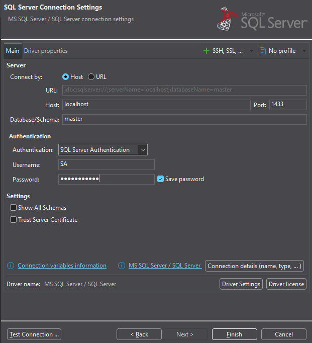
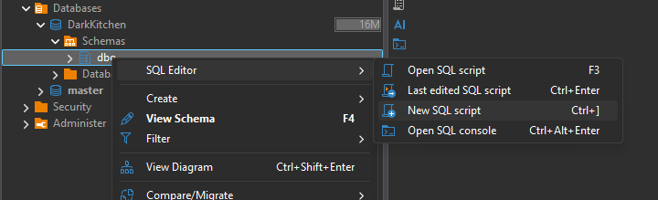
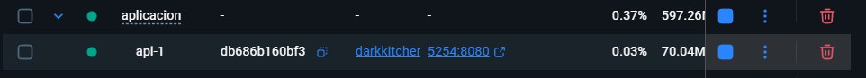
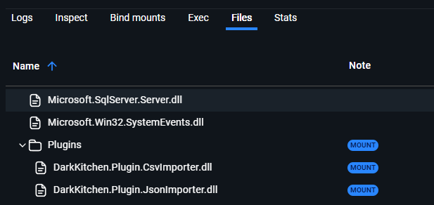
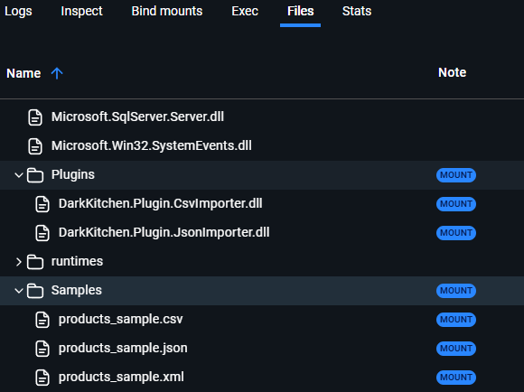

# DarkKitchen — Deploy

## Requisitos
- Docker Desktop instalado

## Pasos

1. Abrir una terminal en esta carpeta (Aplicacion/)

2. Cargar las imágenes:
   
   docker load < api.tar
   
   docker load < frontend.tar

3. Levantar todo:
   docker-compose up

4. Esperar hasta ver "Now listening on: http://[::]:8080" en los logs

5. Abrir el browser en:
   - Frontend: http://localhost:8080
   - API:      http://localhost:5254

## Para bajar todo
   docker-compose down

## Para cargar datos en la DB

Abrí DBeaver y creá una nueva conexión:

1. **New Database Connection** → seleccioná **SQL Server**
2. Completá los datos:
   - **Host:** `localhost`
   - **Port:** `1433`
   - **Authentication:** SQL Server Authentication
   - **Username:** `SA`
   - **Password:** `MyPass@word`

3. Tildá **Trust Server Certificate**
4. Hacé click en **Test Connection** para verificar y luego **Finish**

---

Una vez conectado:

1. En el panel izquierdo expandí la conexión → **Databases** → **DarkKitchen** → **Schemas**
2. Click derecho sobre el schema → **SQL Editor** → **Open SQL script**
3. Copia el contenido de DatosIniciales.sql o DatosVacios.sql y ejecuta

## Para importar plugins

1. En docker desktop abri el container de la api

2. vas a Files -> app/Plugins y ahí se deben añadir/quitar los importadores que la quieras que la aplicación use

### Importante
Para la ruta que te va a pedir la aplicacion, esta debe ser dentro del container.

Ejemplo: /app/Samples/products_sample.csv
